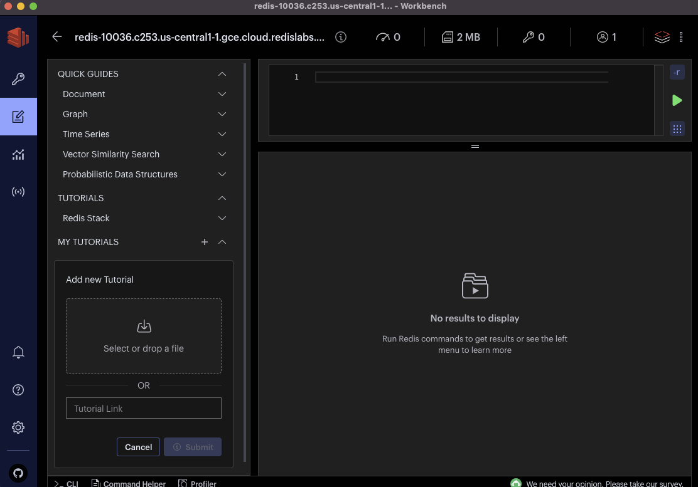

## Getting started

### 1. Download the repo as a Zip file

    
### 2. Create a Redis Cloud subscription
Follow this [link](https://docs.redis.com/latest/rc/rc-quickstart/#create-an-account) through step 6. In step 4, choose Google Cloud. Then come back here to continue on section 3 below to install and configure RedisInsight.

### 3. Install & Configure RedisInsight

    

#### 4. Import & Run the tutorial 

